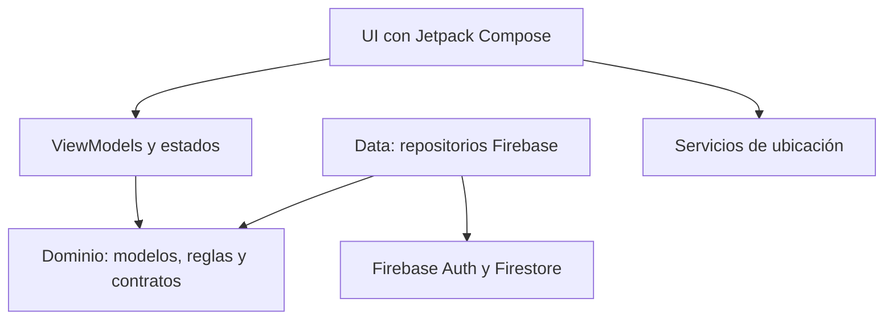
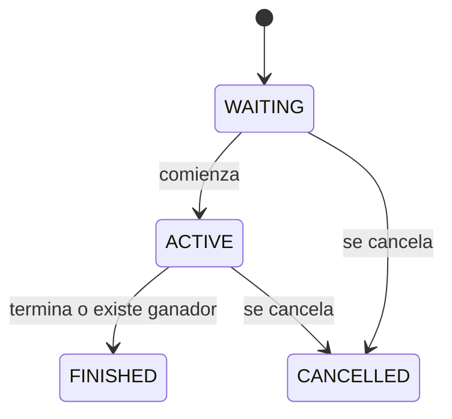

# BetFriends

BetFriends es una aplicación Android para crear retos privados entre amigos, invitar participantes y determinar resultados mediante tiempo o ubicación.

El proyecto se encuentra en proceso de migración hacia un sistema cerrado de **puntos BF**. No contempla depósitos, retiros, conversiones ni manejo de dinero real.

## Funcionalidades actuales

- Registro e inicio de sesión con correo y contraseña.
- Restauración y cierre de sesión.
- Consulta del perfil y saldo actual.
- Creación de apuestas por tiempo o ubicación.
- Búsqueda de participantes mediante correo.
- Envío, aceptación y rechazo de invitaciones.
- Consulta de apuestas en tiempo real.
- Validación de ubicación y check-in.
- Determinación básica del ganador.

## Tecnologías

| Tecnología | Uso |
|---|---|
| Kotlin | Lenguaje principal |
| Jetpack Compose | Interfaz de usuario |
| Navigation 3 | Navegación entre pantallas |
| Firebase Authentication | Registro e inicio de sesión |
| Cloud Firestore | Usuarios, apuestas e invitaciones |
| Google Play Services Location | Obtención de ubicación |
| Gradle 9.6.0 | Sistema de compilación |
| Android Gradle Plugin 9.4.1 | Compilación Android |

## Requisitos

Antes de iniciar se necesita:

- Git.
- Android Studio compatible con AGP 9.4.1.
- JDK 17 o superior.
- Android SDK API 37.
- Android SDK Build Tools 36.0.0 o superior compatible.
- Emulador o dispositivo con Android 8.0/API 26 o superior.
- Acceso a un proyecto Firebase de desarrollo.
- Conexión a Internet.

## Instalación

### 1. Clonar el repositorio

```bash
git clone https://github.com/alfredocorona16/Betfriends_MobileApp.git
cd Betfriends_MobileApp
```

### 2. Abrir el proyecto

1. Abrir Android Studio.
2. Seleccionar **Open**.
3. Elegir la carpeta `Betfriends_MobileApp`.
4. Esperar a que finalice la sincronización de Gradle.

### 3. Configurar Firebase

El proyecto utiliza una aplicación Firebase con el paquete:

```text
com.betfriends.app
```

En Firebase deben estar habilitados:

- Authentication con correo y contraseña.
- Cloud Firestore.
- Una aplicación Android registrada con el paquete indicado.

El archivo de configuración debe ubicarse en:

```text
app/google-services.json
```

Para utilizar un proyecto Firebase propio:

1. Crear un proyecto en Firebase Console.
2. Registrar una aplicación Android.
3. Escribir `com.betfriends.app` como nombre del paquete.
4. Descargar `google-services.json`.
5. Colocarlo dentro de la carpeta `app`.
6. Habilitar Authentication con correo y contraseña.
7. Crear la base de datos Cloud Firestore.

> Utilizar únicamente Firebase de desarrollo o pruebas. No agregar cuentas de servicio, claves privadas, contraseñas de firma, archivos `.jks`, tokens o credenciales administrativas al repositorio.

## Compilación y pruebas

En Git Bash, Linux o macOS:

```bash
./gradlew testDebugUnitTest
./gradlew assembleDebug
```

En PowerShell o CMD:

```powershell
.\gradlew.bat testDebugUnitTest
.\gradlew.bat assembleDebug
```

Los comandos deben finalizar con:

```text
BUILD SUCCESSFUL
```

El APK de depuración se genera en:

```text
app/build/outputs/apk/debug/app-debug.apk
```

## Ejecutar la aplicación

1. Abrir **Device Manager** en Android Studio.
2. Iniciar un emulador con API 26 o superior.
3. Presionar **Run app**.
4. Autorizar los permisos de ubicación cuando se soliciten.
5. Registrar al menos dos cuentas para probar invitaciones.

Para probar apuestas por ubicación en un emulador, se debe establecer una ubicación desde los controles extendidos del emulador.

## Arquitectura

El proyecto está organizado por responsabilidades:



### Paquetes principales

```text
com.betfriends.app
├── data
│   ├── auth          # Implementación de autenticación Firebase
│   ├── bet           # Persistencia de apuestas e invitaciones
│   └── users         # Directorio de usuarios
├── domain
│   ├── model         # Modelos de dominio
│   ├── repository    # Contratos de repositorios
│   └── rules         # Reglas de apuestas y check-in
├── location          # Obtención de ubicación
├── navigation        # Rutas y navegación
└── ui
    ├── auth           # Login, registro y splash
    ├── bets           # Listado, invitaciones y check-in
    ├── createbet      # Creación de apuestas
    ├── home           # Pantalla principal
    ├── components     # Componentes reutilizables
    └── theme          # Tema visual
```

## Navegación

Las rutas actuales son:

- `Splash`
- `Login`
- `Register`
- `Home`
- `CreateBet`
- `MyBets`

Una persona sin sesión solamente puede permanecer en Login o Register. Una sesión activa redirige al Home.

## Modelo de Firebase

### `usuarios/{uid}`

Datos privados de cada cuenta.

| Campo | Tipo | Descripción |
|---|---|---|
| `nombre` | String | Nombre visible |
| `correo` | String | Correo registrado |
| `saldo` | Number | Saldo legado; se migrará a puntos BF |
| `fechaCreacion` | Timestamp | Fecha del servidor |

El identificador del documento corresponde al UID de Firebase Authentication.

### `perfilesPublicos/{uid}`

Datos utilizados para buscar e invitar usuarios.

| Campo | Tipo | Descripción |
|---|---|---|
| `uid` | String | UID del usuario |
| `nombre` | String | Nombre visible |
| `correo` | String | Correo del usuario |
| `correoBusqueda` | String | Correo normalizado |
| `actualizadoEn` | Number | Fecha en milisegundos |

### `apuestas/{betId}`

| Campo | Tipo | Descripción |
|---|---|---|
| `id` | String | Identificador de la apuesta |
| `title` | String | Título |
| `description` | String | Descripción |
| `type` | String | `TIME` o `LOCATION` |
| `startsAtMillis` | Number | Inicio en milisegundos |
| `endsAtMillis` | Number | Finalización en milisegundos |
| `creatorId` | String | UID del creador |
| `creatorName` | String | Nombre del creador |
| `participants` | Array | Información de participantes |
| `participantIds` | Array | UID de todos los participantes |
| `acceptedParticipantIds` | Array | UID de participantes aceptados |
| `stakePerParticipant` | Number | Aporte legado; migrará a puntos BF |
| `confirmedPot` | Number | Acumulado confirmado |
| `status` | String | Estado de la apuesta |
| `winnerName` | String/null | Nombre del ganador |
| `createdAtMillis` | Number | Fecha de creación |
| `updatedAtMillis` | Number | Última actualización |

Las apuestas de ubicación también pueden contener:

- `locationName`
- `radiusMeters`
- `targetLatitude`
- `targetLongitude`
- `targetAccuracyMeters`

Cada elemento de `participants` contiene:

- `id`
- `name`
- `email`
- `invitationStatus`

### `invitaciones/{betId}_{inviteeId}`

| Campo | Tipo | Descripción |
|---|---|---|
| `id` | String | Identificador compuesto |
| `betId` | String | Apuesta relacionada |
| `betTitle` | String | Título de la apuesta |
| `inviterId` | String | UID del creador |
| `inviterName` | String | Nombre del creador |
| `inviteeId` | String | UID del invitado |
| `inviteeName` | String | Nombre del invitado |
| `stakeAmount` | Number | Aporte solicitado |
| `status` | String | Estado de la invitación |
| `createdAtMillis` | Number | Fecha de creación |
| `updatedAtMillis` | Number | Última actualización |

## Estados de una apuesta



| Estado | Significado |
|---|---|
| `WAITING` | Esperando inicio o respuesta de participantes |
| `ACTIVE` | Apuesta en curso |
| `FINISHED` | Apuesta finalizada |
| `CANCELLED` | Apuesta cancelada |

Las transiciones automáticas todavía están en proceso de implementación. Actualmente, el sistema utiliza principalmente `WAITING` y `FINISHED`.

## Seguridad y archivos locales

Nunca deben subirse:

- `local.properties`
- Carpetas `.idea`, `.gradle` o `.kotlin`
- Keystores `.jks` o `.keystore`
- Contraseñas de firma
- Cuentas de servicio Firebase
- Archivos con `private_key`
- Tokens o credenciales administrativas
- Registros de errores locales

Las reglas e índices de Firestore todavía deben incorporarse al repositorio como parte de `BF-TASK-05`.

## Limitaciones conocidas

- El saldo todavía utiliza `Double` y terminología monetaria.
- La migración a puntos BF enteros está pendiente.
- Los check-ins aún no se conservan completamente en Firestore.
- La liquidación del ganador todavía no es atómica.
- Las reglas e índices Firebase no están versionados.
- Las fechas dependen parcialmente de la zona horaria del dispositivo.
- La aplicación no maneja ni manejará dinero real en esta versión.

## Validación básica

Para probar el flujo principal:

1. Registrar dos cuentas.
2. Iniciar sesión con la primera.
3. Crear una apuesta e invitar a la segunda cuenta.
4. Iniciar sesión con la segunda.
5. Aceptar o rechazar la invitación.
6. Confirmar que la apuesta aparezca para ambos usuarios.
7. Probar el check-in por tiempo o ubicación.